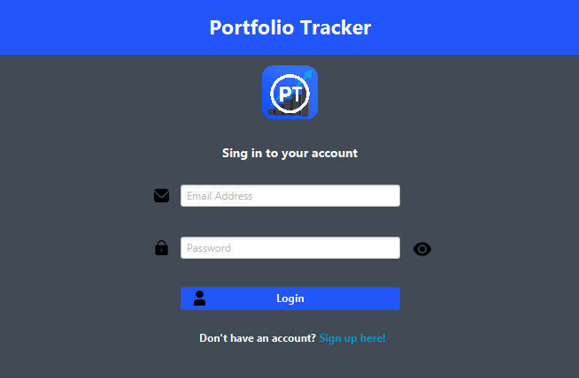
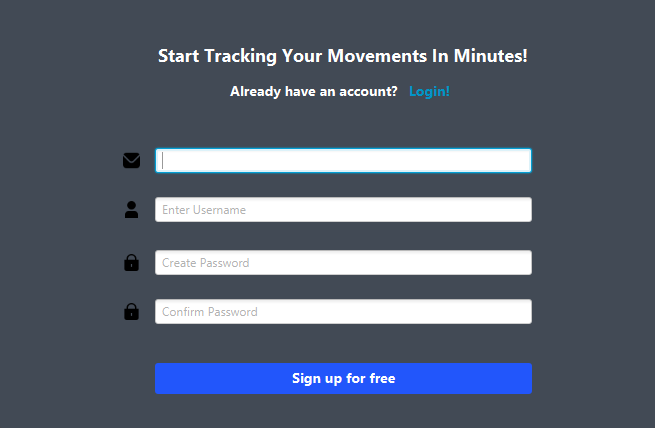
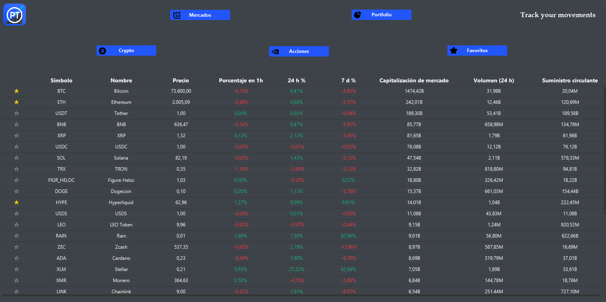
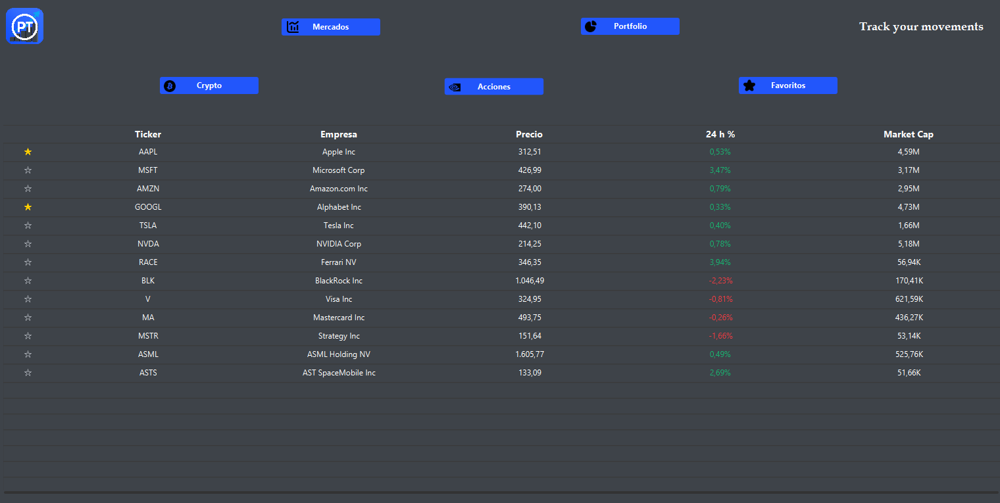
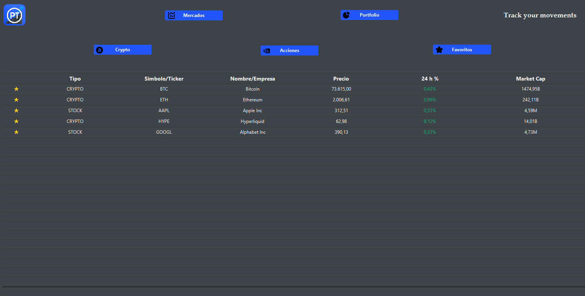
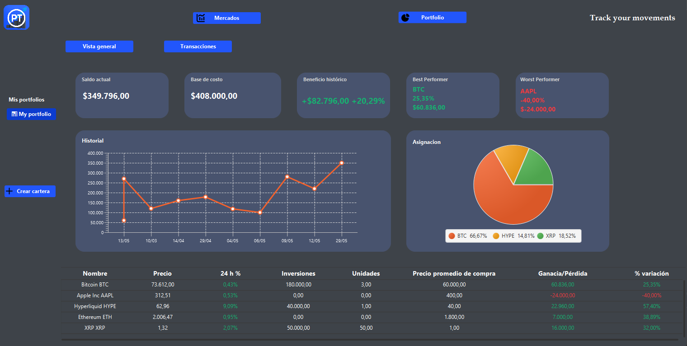
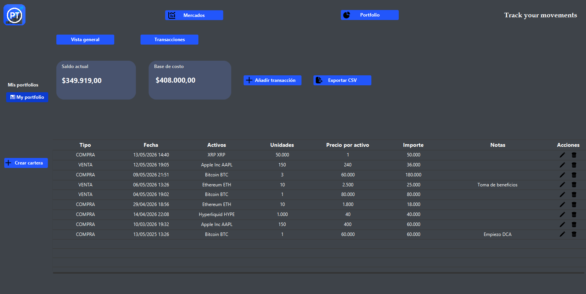
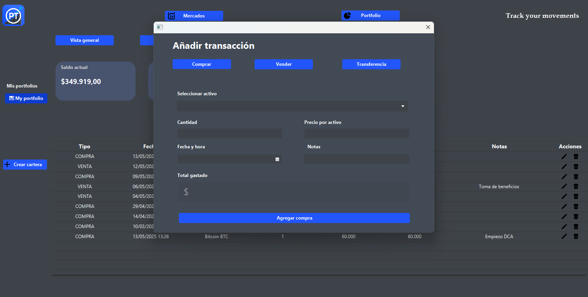
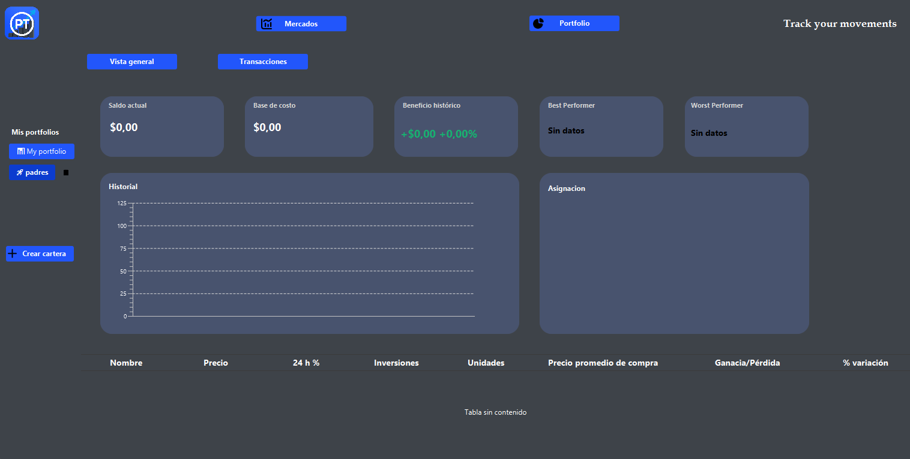

# Portfolio Tracker

Desktop application developed with JavaFX to manage investment portfolios, record transactions made in financial markets, obtain statistics from those transactions, and analyze whether our decision-making remains profitable over time.

The project is designed as a personal tool for tracking investments by centralizing portfolios, transactions, favorites, and market prices. It combines data stored in SQL Server with information obtained from external APIs such as Finnhub and CoinGecko.

## Features

- User registration and login.
- Credential storage with BCrypt hashing.
- Portfolio management by user.
- Recording of buy, sell, and transfer transactions in financial markets.
- Transaction export to CSV.
- Statistics calculated from completed transactions.
- Line chart to visualize the evolution of the portfolio balance.
- Donut chart to show the percentage distribution of assets in the portfolio.
- Portfolio metrics such as cost basis, performance, best asset and worst asset.
- Summary table of assets held in the portfolio, including calculated statistics by position.
- Stock lookup through Finnhub.
- Cryptocurrency lookup through CoinGecko.
- Favorites view to track selected assets.
- Interface designed with JavaFX, FXML, CSS, and Scene Builder.
- Data persistence in SQL Server.
- Layered structure: JavaFX controllers, models, and DAOs.
- Sensitive configuration through environment variables.

## Screenshots

### Login



### Registration



### Cryptocurrencies



### Stocks



### Favorites



### Portfolio



### Transactions



### Add Transactions



### New Portfolio



## Technologies

- Java 23
- JavaFX
- Scene Builder
- FXML and CSS
- SQL Server
- JDBC
- Finnhub API
- CoinGecko API
- org.json
- jBCrypt
- NetBeans / Ant

## Project Structure

```text
src/
+-- Controlador/       # JavaFX controllers for the views
+-- Dao/               # Data access and SQL queries
+-- Imagenes/          # Graphic resources for the application
+-- Modelo/            # Entities, services, and configuration
+-- Vista/             # FXML files and CSS stylesheets
+-- portfoliotracker/  # Main startup class
database/
+-- schema.sql         # Table creation script for SQL Server
```

The main class is:

```text
portfoliotracker.PortfolioTracker
```

## Configuration

The application does not store credentials or API keys directly in the code. To run it correctly, define the following environment variables:

| Variable | Description |
| --- | --- |
| `DB_HOST` | SQL Server host or IP address |
| `DB_PORT` | SQL Server port |
| `DB_NAME` | Database name |
| `DB_USER` | Database user |
| `DB_PASSWORD` | Database password |
| `FINNHUB_KEY` | Finnhub API key |

PowerShell example for user variables:

```powershell
[Environment]::SetEnvironmentVariable("DB_HOST", "localhost", "User")
[Environment]::SetEnvironmentVariable("DB_PORT", "1433", "User")
[Environment]::SetEnvironmentVariable("DB_NAME", "PortfolioTracker", "User")
[Environment]::SetEnvironmentVariable("DB_USER", "your_user", "User")
[Environment]::SetEnvironmentVariable("DB_PASSWORD", "your_password", "User")
[Environment]::SetEnvironmentVariable("FINNHUB_KEY", "your_api_key", "User")
```

After creating or modifying environment variables, close and reopen NetBeans or the terminal from which you run the application.

## Database

The project uses SQL Server through JDBC. The table creation script is available at:

```text
database/schema.sql
```

To prepare the database from scratch:

1. Create a database in SQL Server, for example `PortfolioTracker`.
2. Run `database/schema.sql` against that database.
3. Configure the environment variables listed in the configuration section.
4. Start the application and register a user from the interface.

Main tables used by the code:

- `USUARIOS`
- `PORTFOLIOS`
- `ACTIVOS`
- `TRANSACCIONES`
- `FAVORITOS`

No required seed data is included. Users, portfolios, assets, transactions, and favorites are created from the application itself. When a user logs in, if they do not have any portfolios, the application automatically creates a default portfolio.

> Note: if you clone this project from scratch, you need to create the database and run `database/schema.sql` before using the application.

## Running the Application

### From NetBeans

1. Clone the repository.
2. Open the project in NetBeans.
3. Configure the required libraries:
   - JavaFX
   - Microsoft JDBC Driver for SQL Server
   - org.json
   - jBCrypt
4. Create the environment variables listed in the configuration section.
5. Run the project from NetBeans.

### From Ant

If you have Ant configured on your system:

```bash
ant clean
ant jar
ant run
```

## External APIs

### Finnhub

Used to obtain stock information, company profiles, and quotes.

The key is read from:

```java
System.getenv("FINNHUB_KEY")
```

### CoinGecko

Used to obtain cryptocurrency market information. It currently does not require an API key in this configuration.

## Security

- The Finnhub key is loaded from an environment variable.
- Database credentials are loaded from environment variables.
- User passwords are stored with BCrypt hashing.
- API keys, passwords, `nbproject/private/` files, generated builds, and `.class` files must not be committed to the repository.

## Author

Developed by Samuel.
